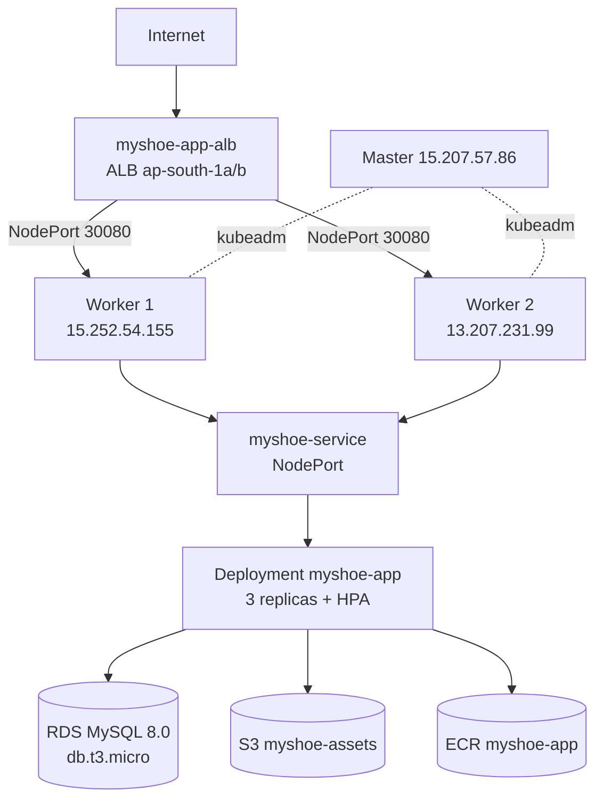

# Architecture Diagram — MyShoe

```
Internet
   │
   │  CNAME myshoe.sytes.net → myshoe-app-alb-1194032437.ap-south-1.elb.amazonaws.com
   ▼
┌─────────────────────────────┐
│  ALB (ap-south-1a + 1b)     │  SG: alb (80/443 from 0.0.0.0/0)
│  Listener 80 → TG:8000      │  (443 pending ACM validation at sytes.net)
│  Health: /health            │
└──────────────┬──────────────┘
               │  NodePort 30080
       ┌───────┴────────┐
       ▼                ▼
┌─────────────┐  ┌─────────────┐
│ Worker 1    │  │ Worker 2    │  t3.micro, SG: k8s-nodes
│ 15.252.54.155  │ 13.207.231.99│  (22,6443,10250,30080)
│ Kubelet     │  │ Kubelet     │  Docker 24, kubeadm 1.30
│ Pods (app)  │  │ Pods (app)  │
└──────┬──────┘  └──────┬──────┘
       │                │
       └───────┬────────┘
               │ 30080
         ┌─────┴─────┐
         │ K8s Service│  myshoe-service (NodePort)
         │ Deployment │  3 replicas, HPA 2–6, probes /health
         │ ConfigMap  │  DB_HOST/PORT/NAME/USER
         │ Secret     │  DB_PASSWORD
         └─────┬─────┘
               │
┌──────────────┼──────────────┐
│              ▼              │
│   RDS MySQL 8.0             │  db.t3.micro, private subnets
│   myshoe (10.0.2.0/24)      │  SG: rds (3306 from VPC only)
│   Encrypted, backup 0       │  S3: myshoe-assets-470999030662 (images)
│                             │  ECR: 470999030662.dkr.ecr.../myshoe-app
└─────────────────────────────┘

Master 15.207.57.86 (10.0.2.151) — kubeadm init, not in ALB target group
VPC 10.0.0.0/16 — IGW + NAT GW (10.0.1.0/24 public, 10.0.2.0/24 private per AZ)
```

Mermaid (paste into https://mermaid.live or GitHub README):

